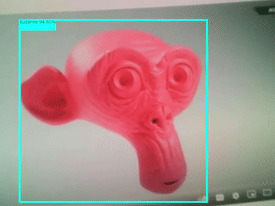
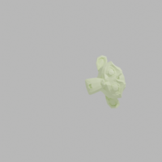
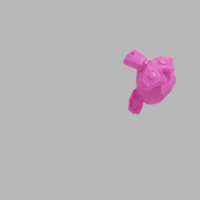
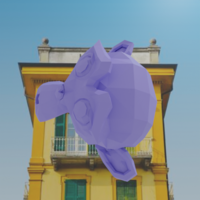

Synthetic datageneration for machine learning models with Blender monkey aka Suzanne. This is an improved version of [my previous try](https://github.com/ku6ryo/suzanne-detector). The training dataset is generted by Blender. Model training is done based on the procedure of [this article](https://blog.tensorflow.org/2021/01/custom-object-detection-in-browser.html).

# Dataset
In the previous try, I did not put any background image and used just a gray mono-color. However, to use photos from webcam, the background is important because the webcame photo never has mono-color background in the real world. 

Previous

This time

In Blender I just placed a monkey and a plane. The plane is the background with random photo. The monkey is a target which moved, rotated and changed its color.
Check `suzanne.blend` and `script.py` for the details of the dataset generation.

I'm using Cycles renderer. With the default rendering setting, it takes 5 sec to render an image and it takes 50 min to generate 600 training images. I used GPU to render and reduced light bounce threshold to 2 for each item (e.g. Diffuse, Glossy etc.) and max samples to 512. It saved 70% of the time of dataset generation. The quality of the image is not much different from the default setting.

## Random background images
I downloaded images from [Unsplash](https://unsplash.com/). I did not know what kind of images are appropriate, so I just selecteed randomly. I converted them to 500x500 by ImageMagick.

# Training
I used 6000 as the steps of training.

Metrics of checkpoints in the training can be checked on [this page](https://tensorboard.dev/experiment/O7KQbyHKQpWT4FdKyyMfqA/#scalars).

# Precision
With test dataset the result is pretty good.
- 99% @0.5 IOU
- 90% @0.75 IOU

However, there are some images which are not detected through webcam.

# Speed
- Winwows 11:
  - CPU: Intel Core i9-9900
  - GPU: NVIDIA RTX 2080
  - Time per detection: ~70ms (14 FPS)